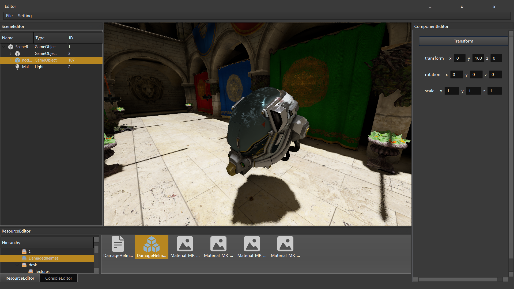

# InstRenderer
A simple global illumination renderer implemented with Vulkan, with an editor developed using Qt6.

## Features
- Deferred rendering
- PBR
- SSAO
- PCF/PCSS
- CSM
- DDGI
- Render graph
- Bindless render 
## Requirements 
**Qt6**,**Vulkan 1.3**  
Tested only on Windows 11 using MinGW

 
